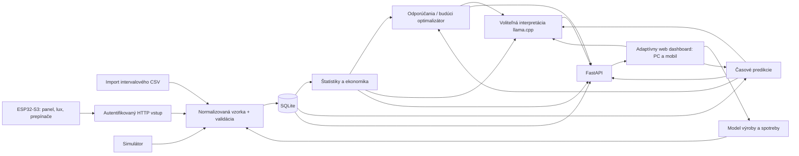

# Inteligentný lokálny energetický systém domácnosti

Pracovný názov SOČ: „Inteligentný lokálny systém pre monitorovanie, predikciu a optimalizáciu energetickej spotreby a výroby domácnosti“.

## Rozsah a rozhodnutia

Jadro beží na PC a poskytuje responzívnu webovú aplikáciu v lokálnej sieti, dostupnú aj na mobile. Verzia 0.5.0 pridáva plánovanie bez hardvéru podľa internetového počasia, import intervalovej spotreby z CSV a lokálneho asistenta cez Ollamu. Demo má pripravené scenáre a zrýchlený čas; plánovanie vytvára minútové odhady a CSV poskytuje analýzu vlastnej histórie. Spotreba bez merania zostáva modelovaná. Voliteľný hybridný model s ESP32 zostáva podporovaný. Demo a import fungujú offline; Open-Meteo potrebuje internet. Server používa jeden worker v dôveryhodnej LAN, bez verejného vystavenia.

- Python + FastAPI: validované REST API, riadený životný cyklus simulátora, automatická dokumentácia.
- SQLite (WAL): jedna lokálna databáza, žiadny databázový server; transakcie a index času. Výpočty a ukladanie sú serializované jedným aplikačným zámkom. Spúšťať jeden worker.
- HTML/CSS/JavaScript ES modules: responzívny dashboard, SVG toky a grafy, bez CDN, bez zostavovania a bez frontendového frameworku. Pri väčšom rozsahu možno UI nahradiť, API ostane rovnaké.
- Normalizovaný záznam: čas UTC, interval v sekundách, výkon W, energia kWh, napätie V, prúd A, SOC %, ceny EUR/kWh, označenie zdroja a kvality. UI ani analytika nepoznajú implementáciu zdroja.
- Klienti načítavajú živý REST stav približne každých 0,5 s a históriu najviac každých 1,5 s. ESP32 odosiela telemetriu každú sekundu cez autentifikovaný HTTP endpoint. SSE je ďalšia možnosť pri potrebe väčšieho počtu klientov.

## Tok dát



## Moduly a hranice

| Modul | MVP na PC | Neskoršia iterácia |
|---|---|---|
| Domácnosť | Profil spotreby, virtuálne RMS napätie/prúd, intervalová energia; prepínače ESP32 menia záťaž | Import nameraného datasetu |
| Sieť | Import/export, výpadok, nepokrytý odber a obmedzená výroba | Externý zdroj meraní až po osobitnom zadaní |
| FV | kWp, azimut, sklon, lokalita; simulácia alebo škálovanie reálneho výkonu malého panela | Open-Meteo žiarenie + pvlib transpozícia a teplotný model |
| Vietor | Virtuálna turbína, interpolovaná výkonová krivka | Import krivky výrobcu, výška náboja a korekcia hustoty |
| Batéria | Kapacita, SOC, výkonové limity, účinnosť, čas do limitu | Degradácia, model meniča, optimalizácia cyklov |
| Počasie | Simulované údaje; v hybride reálny lux a voliteľná teplota | Internet, neskôr lokálna stanica + internetová predpoveď |
| Ceny | Voliteľné, manuálne alebo časové pásma, nákup/výkup a poplatky | Prednastavené internetové a vlastný API provider |
| Predikcia | Sezónny naivný time-series baseline, hodnotenie na minulých dátach | Ridge/HistGradientBoosting, lagy, kalendár, počasie, walk-forward validácia |
| Interpretácia | Deterministické pravidlá zo skutočne vypočítanej vzorky | Voliteľný lokálny llama.cpp server |
| Optimalizácia | Pravidlové odporúčania, autonómna batériová bilancia | 24–48 h plán nabíjania s obmedzeniami a porovnaním s baseline |

## Fyzika a čas

V DEMO MODE každý krok reprezentuje 300 simulačných sekúnd. Rýchlosť nastavuje počet krokov za reálnu sekundu a nový experiment dostane syntetický deň histórie. Monitorovací režim používa sekundové intervaly, beží v reálnom čase a začína jednou vzorkou. Interval končí časom vzorky. Výkon je priemerný za interval, energia = W × sekundy / 3 600 000. Scenár reštartuje iba stav virtuálnej domácej batérie, neposúva čas dozadu; história zostáva a nesie názov scenára. Nový profil nastavení začne samostatný experiment (run), aby sa nemiešala ekonomika a konfigurácie.

Znamienka: sieť + import / − export; batéria + vybíjanie / − nabíjanie. Bilancia: FV + vietor + sieť + batéria = obslúžená spotreba + obmedzená výroba. Požadovaná spotreba = obslúžená + nepokrytá. SOC nikdy neprekročí 10–100 %, nabitie/vybitie je obmedzené dostupnou energiou aj výkonom. Účinnosť nabíjania aj vybíjania je 95 %. Pri výpadku je import/export nula; model predpokladá virtuálny ostrovný menič. Napätie a prúd sú zjednodušené jednofázové RMS ekvivalenty pri účinníku 1, nie merania reálnej siete.

FV simulátor používa dennú sínusovú obálku, sezónny faktor, zemepisnú šírku, koeficient orientácie/sklonu, teplotu a žiarenie. Nie je to projektantský model ani predpoveď podľa internetového počasia. V hybridnom režime sa namiesto tejto FV krivky použije pomer `panel_power_w / pv_reference_w`, ohraničený na 120 %, a vynásobí sa nastaveným výkonom elektrárne. Ide o škálovaný didaktický experiment; malý panel fyzicky nenapája virtuálnu domácnosť. V plánovaní súradnice, orientácia a sklon vstupujú do Open-Meteo; výkon FV používa žiarenie na rovine panelov, straty a teplotnú korekciu. Táto aproximácia nie je validovaná proti reálnej elektrárni. Výkon turbíny má cut-in 3 m/s, menovitý vietor 12 m/s a cut-out 25 m/s. Vstupný vietor reprezentuje vietor pri turbíne.

## Ukladanie a API

Databázová verzia 2 pridáva persistovanú meteorologickú cache. Tabuľky `settings` (validované JSON nastavenia), `runs` (konfigurácia experimentu), `samples` (normalizované JSON + indexované run_id a čas). Dátový kontrakt je Pydantic `Sample` v `backend/models.py`; databáza má `user_version` pre budúce migrácie. MVP uchováva históriu bez automatického mazania. Pri dlhodobom behu doplniť hodinové/denné agregácie a retenčnú politiku; API už obmedzuje graf na agregované body.

Kľúč ESP32 vzniká lokálne v `data/device_key.txt`, nie je súčasťou Gitu a server ho porovnáva časovo bezpečnou funkciou. Zápisy z webového prehliadača majú kontrolu pôvodu. HTTP je vhodné iba v dôveryhodnej izolovanej LAN; port 8765 sa nepresmeruje na internet. Pri nasadení mimo domácej siete treba HTTPS, používateľskú autentifikáciu a prísnejšie pravidlá firewallu.

| API | Význam |
|---|---|
| GET /api/state | Vzorka, nastavenia, stav simulátora, odporúčania |
| PUT /api/settings | Validácia a uloženie; zmena modelu vytvorí nový súbor údajov |
| GET /api/history?period=day/week/month/all&run_id=ID | Graf a intervalovo vážené súčty |
| GET /api/forecast | 24 h meteorologický výhľad alebo sezónny baseline, MAE pri dostatočnej histórii |
| POST /api/demo | Scenár, pauza, rýchlosť alebo jeden krok |
| POST /api/device/telemetry | Telemetria ESP32-S3 chránená hlavičkou `X-Device-Key` |
| GET /api/export?run_id=ID | Export aktuálnej alebo archivovanej histórie |
| POST /api/import | Atomický CSV import intervalových kWh |
| GET /api/runs | Konfigurácie a rozsahy uložených histórií |
| GET /api/locations?q=city | Vyhľadanie mesta cez Open-Meteo |
| GET /api/weather | Aktuálne počasie, 72 h výhľad, čas a stav cache |
| GET /api/assistant/status | Dostupnosť Ollamy a vybraného modelu |
| POST /api/assistant/chat | Lokálna odpoveď a podkladové fakty |
| GET /api/health | Stav procesu a databázy |
| GET /docs | Interaktívna API dokumentácia |

## Internetové počasie

`weather.py` používa pevné API adresy Open-Meteo. Lokalitu používateľ explicitne vyberie cez mesto alebo povolí GPS; súradnice sa zaokrúhľujú na tri desatinné miesta. Backend zjednocuje UTC a jednotky. Cache sa obnovuje každých desať minút, neúspešný pokus najskôr po minúte. Dáta staršie než pol hodiny od stiahnutia alebo 45 minút od pozorovania sú označené ako staré. Výpadok internetu nevytvára simulovanú náhradu a plánovanie počká na aktuálne dáta. Pozri [reálne používanie](REALNE_POUZITIE.md).

Ceny zostávajú ručné alebo časové. Internetový cenový provider a vlastné cenové API nie sú implementované.

## Predikcie, LLM a vedecká časť

LLM nikdy nepočíta energetickú predikciu. Baseline je predchádzajúci deň rovnakého času. Zmerať MAE a RMSE samostatne pre spotrebu a výrobu; validácia iba na časovo neskorších dátach, žiadny náhodný split ani únik budúcich informácií. Ďalší model: lag 1/24/168 h, deň v týždni, sviatky, časové harmonické a dostupná predpoveď počasia. Syntetické dáta overia mechaniku, nie kvalitu na reálnej domácnosti.

Lokálna Ollama používa Qwen3 0.6B alebo 1.7B na tom istom PC. `assistant.py` povolí iba loopback endpoint, jeden výpočet naraz, vypnuté premýšľanie, krátky kontext, limit výstupu a timeout. Dostane výpočtové fakty s pôvodom a malú históriu konverzácie. Čísla v odpovedi sa dopĺňajú cez ID faktov; neznáme ID a ďalšie číslice odpoveď zadržujú. Voľný text stále môže obsahovať nesprávnu interpretáciu a nie je zárukou proti halucinácii. Žiadne ovládanie zariadení ani cloudový model. Inštalácia a hranice: [lokálny asistent](LOKALNY_ASISTENT.md).

Ekonomika: import × (nákup + variabilná distribúcia) − export × výkup + pomerný fixný poplatok. Referenčné náklady = obslúžená spotreba bez lokálnej výroby pri rovnakej tarife. Rozdiel je prevádzková úspora, nezohľadňuje investíciu, degradáciu ani dane navyše; pri počiatočne nabitej batérii ide o energiu zo syntetického počiatočného stavu. Tarify sú používateľské ilustračné hodnoty, nie aktuálny cenník. Pri vypnutí cien API vracia ekonomiku ako nedostupnú.

## Štruktúra repozitára

```text
backend/
  main.py           # FastAPI, životný cyklus, REST, lokálne statické súbory
  models.py         # Normalizovaný dátový kontrakt, nastavenia, validácia
  simulator.py      # Počasie, FV, turbína, batéria a bilančné rovnice
  storage.py        # SQLite, experimenty, história a ekonomika
  analytics.py      # Časová a meteorologická predikcia, pravidlá
  weather.py        # Internetové počasie, geocoding, cache
  import_data.py    # CSV validácia a výpočet intervalových taríf
  assistant.py      # Lokálna Ollama a fakty pre chat
frontend/
  index.html        # Slovenské UI a setup wizard
  styles.css        # Responzívny vizuálny systém
  app.js            # API, grafy, toky, nastavenia
firmware/esp32-s3/  # Arduino firmvér, lokálna Wi-Fi a HTTP telemetria
tests/              # Bilancia, SOC, ekonomika, API, persistencia
docs/
  ARCHITEKTURA.md
  HARDVER.md
  DEMO.md
data/               # Lokálna SQLite (ignorovaná Gitom)
deliverables/       # Prezentácia a text správy pre učiteľa
requirements.txt
requirements-dev.txt
start.ps1
start.cmd
README.md
```

## Etapy a akceptácia

1. MVP PC: offline štart, wizard, všetkých 8 scenárov, fyzikálna bilancia, SOC, grafy, SQLite, CSV, validácia API, testy. Implementované.
2. Hybridné demo: ESP32-S3 cez router, reálny výkon malého panela, lux, prepínače záťaže a výpadok siete. Server, dátový kontrakt a firmvér sú implementované; zostáva overenie na zakúpenom hardvéri a kalibrácia.
3. Analytika PC: Open-Meteo, fyzikálna aproximácia FV, časový baseline a import CSV sú implementované. Ďalej: validácia proti meraniam, pvlib, cenové API a pokročilejší ML.
4. Interpretácia PC: Ollama a obmedzené číselné výstupy podľa faktov sú implementované. Zostáva inštalácia modelu používateľom a benchmark kvality/rýchlosti na jeho notebooku.
5. Optimalizácia PC: plán spotreby/nabíjania, porovnanie stratégií na identických dátach a spracovanie SOČ výsledkov. Zatiaľ návrh.

## Technické zdroje

- FastAPI lifespan: https://fastapi.tiangolo.com/advanced/events/
- SQLite WAL: https://www.sqlite.org/wal.html
- Open-Meteo: https://open-meteo.com/en/docs
- ESP32-S3 Wi-Fi station: https://docs.espressif.com/projects/esp-idf/en/latest/esp32s3/api-guides/wifi-driver/station-scenarios.html

Tieto zdroje podkladajú voľbu životného cyklu servera, lokálneho úložiska a implementáciu meteorologického providera; vlastné fyzikálne aproximácie sú uvedené vyššie.
